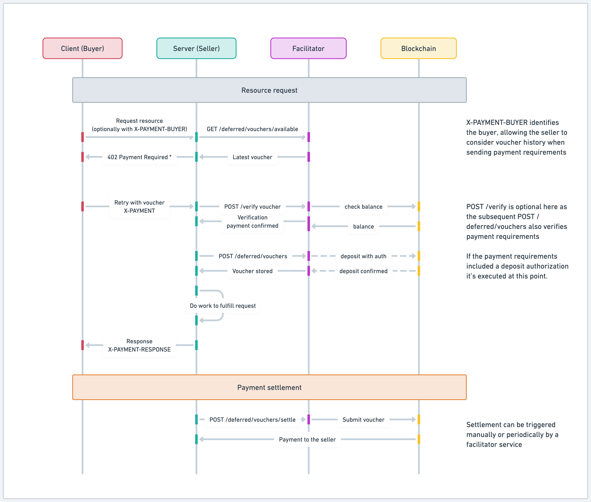

# x402 payments protocol

> "1 line of code to accept digital dollars. No fee, 2 second settlement, $0.001 minimum payment."

```typescript
app.use(
  // How much you want to charge, and where you want the funds to land
  paymentMiddleware("0xYourAddress", { "/your-endpoint": "$0.01" })
);
// That's it! See examples/typescript/servers/express.ts for a complete example. Instruction below for running on base-sepolia.
```

## Philosophy

Payments on the internet are fundamentally flawed. Credit Cards are high friction, hard to accept, have minimum payments that are far too high, and don't fit into the programmatic nature of the internet.
It's time for an open, internet-native form of payments. A payment rail that doesn't have high minimums + % based fee. Payments that are amazing for humans and AI agents.

## Principles

- **Open standard:** the x402 protocol will never force reliance on a single party
- **HTTP Native:** x402 is meant to seamlessly complement the existing HTTP request made by traditional web services, it should not mandate additional requests outside the scope of a typical client / server flow.
- **Chain and token agnostic:** we welcome contributions that add support for new chains, signing standards, or schemes, so long as they meet our acceptance criteria laid out in [CONTRIBUTING.md](https://github.com/coinbase/x402/blob/main/CONTRIBUTING.md)
- **Trust minimizing:** all payment schemes must not allow for the facilitator or resource server to move funds, other than in accordance with client intentions
- **Easy to use:** x402 needs to be 10x better than existing ways to pay on the internet. This means abstracting as many details of crypto as possible away from the client and resource server, and into the facilitator. This means the client/server should not need to think about gas, rpc, etc.

## Ecosystem

The x402 ecosystem is growing! Check out our [ecosystem page](https://x402.org/ecosystem) to see projects building with x402, including:

- Client-side integrations
- Services and endpoints
- Ecosystem infrastructure and tooling
- Learning and community resources

Want to add your project to the ecosystem? See our [demo site README](https://github.com/coinbase/x402/tree/main/typescript/site#adding-your-project-to-the-ecosystem) for detailed instructions on how to submit your project.

**Roadmap:** see [ROADMAP.md](https://github.com/coinbase/x402/blob/main/ROADMAP.md)

## Terms:

- `resource`: Something on the internet. This could be a webpage, file server, RPC service, API, any resource on the internet that accepts HTTP / HTTPS requests.
- `client`: An entity wanting to pay for a resource.
- `facilitator server`: A server that facilitates verification and execution of on-chain payments.
- `resource server`: An HTTP server that provides an API or other resource for a client.

## Technical Goals:

- Permissionless and secure for clients and servers
- Gasless for client and resource servers
- Minimal integration for the resource server and client (1 line for the server, 1 function for the client)
- Ability to trade off speed of response for guarantee of payment
- Extensible to different payment flows and chains

## V1 Protocol

The `x402` protocol is a chain agnostic standard for payments on top of HTTP, leverage the existing `402 Payment Required` HTTP status code to indicate that a payment is required for access to the resource.

It specifies:

1. A schema for how servers can respond to clients to facilitate payment for a resource (`PaymentRequirements`)
2. A standard header `X-PAYMENT` that is set by clients paying for resources
3. A standard schema and encoding method for data in the `X-PAYMENT` header
4. A recommended flow for how payments should be verified and settled by a resource server
5. A REST specification for how a resource server can perform verification and settlement against a remote 3rd party server (`facilitator`)
6. A specification for a `X-PAYMENT-RESPONSE` header that can be used by resource servers to communicate blockchain transactions details to the client in their HTTP response

### V1 Protocol Sequencing (`exact` scheme)


The following outlines the flow of a payment using the `x402` protocol. Note that steps (1) and (2) are optional if the client already knows the payment details accepted for a resource.

1. `Client` makes an HTTP request to a `resource server`.

2. `Resource server` responds with a `402 Payment Required` status and a `Payment Required Response` JSON object in the response body.

3. `Client` selects one of the `paymentRequirements` returned by the server response and creates a `Payment Payload` based on the `scheme` of the `paymentRequirements` they have selected.

4. `Client` sends the HTTP request with the `X-PAYMENT` header containing the `Payment Payload` to the resource server.

5. `Resource server` verifies the `Payment Payload` is valid either via local verification or by POSTing the `Payment Payload` and `Payment Requirements` to the `/verify` endpoint of a `facilitator server`.

6. `Facilitator server` performs verification of the object based on the `scheme` and `network` of the `Payment Payload` and returns a `Verification Response`.

7. If the `Verification Response` is valid, the resource server performs the work to fulfill the request. If the `Verification Response` is invalid, the resource server returns a `402 Payment Required` status and a `Payment Required Response` JSON object in the response body.

8. `Resource server` either settles the payment by interacting with a blockchain directly, or by POSTing the `Payment Payload` and `Payment PaymentRequirements` to the `/settle` endpoint of a `facilitator server`.

9. `Facilitator server` submits the payment to the blockchain based on the `scheme` and `network` of the `Payment Payload`.

10. `Facilitator server` waits for the payment to be confirmed on the blockchain.

11. `Facilitator server` returns a `Payment Execution Response` to the resource server.

12. `Resource server` returns a `200 OK` response to the `Client` with the resource they requested as the body of the HTTP response, and a `X-PAYMENT-RESPONSE` header containing the `Settlement Response` as Base64 encoded JSON if the payment was executed successfully.

### V1 Protocol Sequencing (`deferred` scheme)



The `deferred` scheme modifies the x402 protocol sequencing to allow for a deferred settlement to happen. The following steps outline the resource request and payment verification flow:

1. `Client` makes an HTTP request to a `resource server`, optionally with a `X-PAYMENT-BUYER` header containing the `Client` address.

2. `Resource server` processes the request and builds a `Payment Required Response` JSON object. The contents of the response include information in the `extra` field of the payment requirements, gathered from the facilitator:
  - Voucher details: either a new voucher id for the `Client` to generate or the latest signed voucher for the `Client/Resource server` pair if it exists.
  - Account balance: The `Client`'s onchain balance including outstanding vouchers to settle. Based on these values the `Client` can later opt to send a signed message to authorize deposits on their behalf.
  - If no `X-PAYMENT-BUYER` is provided then the `Resource server` just responds with a new voucher id.

3. `Resource server` responds with a `402 Payment Required` status and the `Payment Required Response` JSON object in the response body.
  
4. `Client`sends an HTTP request with the `X-PAYMENT` header containing the `Payment Payload` to the resource server:
   - If there is no previous `Client/Resource server` history, the `Client` will create and sign a new voucher as the payload.
   - If there is a previous voucher, the `Client` aggregates payments on top of it before signing and adding it to the payload.
   - Optionally, the `Client` can sign a deposit authorization to allow the `facilitator server` to escrow funds on their behalf. 

5. `Resource server` verifies the `Payment Payload` is valid by POSTing the `Payment Payload` and `Payment Requirements` to the `/verify` endpoint of a `facilitator server`. `Facilitator server` performs verification of the object based on the `scheme` and `network` of the `Payment Payload` and returns a `Verification Response`.

6. If the `Verification Response` is valid:
    - The `resource server` POSTs the validated voucher to the `facilitator server` for persistent storage using the endpoint `/deferred/vouchers`
      - The `facilitator server` re-verifies the `Payment Payload` before storing the voucher, which makes the verification call on previous step not mandatory.
      - If a deposit authorization is present the `facilitator server` will execute it.

7. If the `Verification Response` is valid, the resource server performs the work to fulfill the request. If the `Verification Response` is invalid, the resource server returns a `402 Payment Required` status and a `Payment Required Response` JSON object in the response body.

8. `Resource server` returns a `200 OK` response to the `Client` with the resource they requested as the body of the HTTP response, and a `X-PAYMENT-RESPONSE` header.

At this point the `Client` has "paid for" the resource access by means of a signed voucher. The `facilitator server` stores the vouchers which can be redeemed at any time. The settlement sequencing then is as follows:

1. `Resource server` requests a settlement to happen by POSTing to a special `facilitator server` endpoint: `POST /deferred/vouchers/settle`

2. `Facilitator server` retrieves the voucher to be settled and submits the transaction to the blockchain based on the `scheme` and `network` of the `Payment Payload`.

3. `Facilitator server` waits for the voucher settlement to be confirmed on the blockchain.

4. `Facilitator server` returns a `Payment Execution Response` to the resource server.

### Type Specifications

#### Data types

**Payment Required Response**

```json5
{
  // Version of the x402 payment protocol
  x402Version: int,

  // List of payment requirements that the resource server accepts. A resource server may accept on multiple chains, or in multiple currencies.
  accepts: [paymentRequirements]

  // Message from the resource server to the client to communicate errors in processing payment
  error: string
}
```

**paymentRequirements**

```json5
{
  // Scheme of the payment protocol to use
  scheme: string;

  // Network of the blockchain to send payment on
  network: string;

  // Maximum amount required to pay for the resource in atomic units of the asset
  maxAmountRequired: uint256 as string;

  // URL of resource to pay for
  resource: string;

  // Description of the resource
  description: string;

  // MIME type of the resource response
  mimeType: string;

  // Output schema of the resource response
  outputSchema?: object | null;

  // Address to pay value to
  payTo: string;

  // Maximum time in seconds for the resource server to respond
  maxTimeoutSeconds: number;

  // Address of the EIP-3009 compliant ERC20 contract
  asset: string;

  // Extra information about the payment details specific to the scheme
  // For `exact` scheme on a EVM network, expects extra to contain the records `name` and `version` pertaining to asset
  // For `deferred` scheme on a EVM network, expects extra to contain the records `type`, `voucher` and `signature`
  extra: object | null;
}
```

**`Payment Payload`** (included as the `X-PAYMENT` header in base64 encoded json)

```json5
{
  // Version of the x402 payment protocol
  x402Version: number;

  // scheme is the scheme value of the accepted `paymentRequirements` the client is using to pay
  scheme: string;

  // network is the network id of the accepted `paymentRequirements` the client is using to pay
  network: string;

  // payload is scheme dependent
  payload: <scheme dependent>;
}
```

#### Facilitator Types & Interface

A `facilitator server` is a 3rd party service that can be used by a `resource server` to verify and settle payments, without the `resource server` needing to have access to a blockchain node or wallet.

**POST /verify**. Verify a payment with a supported scheme and network:

- Request body JSON:
  ```json5
  {
    x402Version: number;
    paymentHeader: string;
    paymentRequirements: paymentRequirements;
  }
  ```
- Response:
  ```json5
  {
    isValid: boolean;
    invalidReason: string | null;
  }
  ```

**POST /settle**. Settle a payment with a supported scheme and network:

- Request body JSON:

  ```json5
  {
    x402Version: number;
    paymentHeader: string;
    paymentRequirements: paymentRequirements;
  }
  ```

- Response:

  ```json5
  {
    // Whether the payment was successful
    success: boolean;

    // Error message from the facilitator server
    error: string | null;

    // Transaction hash of the settled payment
    txHash: string | null;

    // Network id of the blockchain the payment was settled on
    networkId: string | null;
  }
  ```

**GET /supported**. Get supported payment schemes and networks:

- Response:
  ```json5
  {
    kinds: [
      {
        "scheme": string,
        "network": string,
      }
    ]
  }
  ```

### Schemes

A scheme is a logical way of moving money.

Blockchains allow for a large number of flexible ways to move money. To help facilitate an expanding number of payment use cases, the `x402` protocol is extensible to different ways of settling payments via its `scheme` field.

Each payment scheme may have different operational functionality depending on what actions are necessary to fulfill the payment.
For example `exact`, the first scheme shipping as part of the protocol, would have different behavior than `upto`. `exact` transfers a specific amount (ex: pay $1 to read an article), while a theoretical `upto` would transfer up to an amount, based on the resources consumed during a request (ex: generating tokens from an LLM).

See `specs/schemes` for more details on schemes, and see `specs/schemes/exact/scheme_exact_evm.md` to see the first proposed scheme for exact payment on EVM chains.

### Schemes vs Networks

Because a scheme is a logical way of moving money, the way a scheme is implemented can be different for different blockchains. (ex: the way you need to implement `exact` on Ethereum is very different from the way you need to implement `exact` on Solana).

Clients and facilitators must explicitly support different `(scheme, network)` pairs in order to be able to create proper payloads and verify / settle payments.

## Running example

**Requirements:** Node.js v24 or higher

1. From `examples/typescript` run `pnpm install` and `pnpm build` to ensure all dependent packages and examples are setup.

2. Select a server, i.e. express, and `cd` into that example. Add your server's ethereum address to get paid to into the `.env` file, and then run `pnpm dev` in that directory.

3. Select a client, i.e. axios, and `cd` into that example. Add your private key for the account making payments into the `.env` file, and then run `pnpm dev` in that directory.

You should see activities in the client terminal, which will display a weather report.

## Running tests

1. Navigate to the typescript directory: `cd typescript`
2. Install dependencies: `pnpm install`
3. Run the unit tests: `pnpm test`

This will run the unit tests for the x402 packages.
